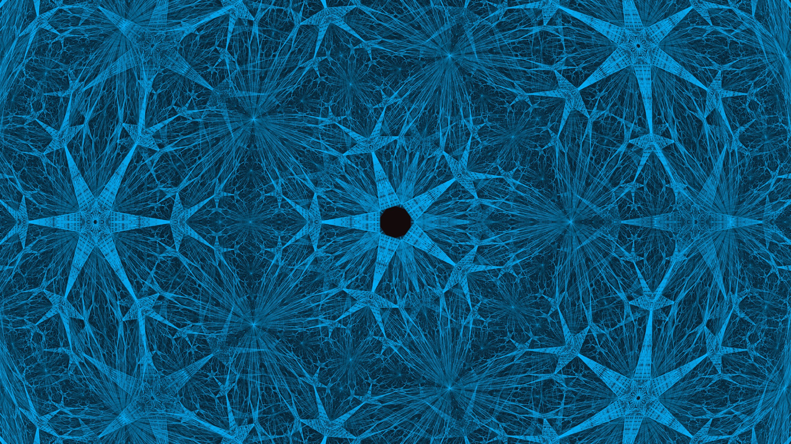

# MachineNet

> *A fullerene is the only closed structure you can build from pentagons and hexagons.*
> *Euler proved it. Chemistry confirmed it. We ran it on a Tesla T4.*

[](https://vsavytsk1.github.io/Mnetv1/shell/eng_v2.0.html)
[](https://vsavytsk1.github.io/Mnetv1/shell/genesis_v8.5.2.html)
[](https://vsavytsk1.github.io/SpookyPrimes/)
[](./LICENSE)

---



> **The C60, from the inside.** Not an artist's impression -- a deep-zoom (`zoom 3000`) into the
> real Goldberg C60 buckyball, rendered face-by-face from the genesis v8.1 `refineFace` operator.
> Twelve pentagons force twelve five-fold rosettes; the crescent defect (`inner 0.10`, `mid 0.10`)
> *is* the picture, kept on purpose; the dark well is a pentagon centred by the flight-lock. Every
> line is a graph edge, not a curve. **P = 12. chi = 2.**
>
> Rendered at **8K** by [`builder/genesis_wallpaper_v1_7.py`](builder/genesis_wallpaper_v1_7.py) --
> the browser canvas ported to numpy, line-for-line, with the exact-integer Goldberg ladder that
> Chromium's float64 cannot reach past `n=39`. Every shell self-certifies (`--cert`): `V=20T`,
> `E=30T`, `P=12`, `chi=2`, `CLOSED`, reproducible sha256. Make your own below.

---

## START HERE

```
https://vsavytsk1.github.io/Mnetv1/shell/eng_v2.0.html
```

**ENG v2.0 -- MASTER CONTROL.** 179 live cards from 390 sims, one URL.
Click any card. Everything runs in your browser. Zero install.
The dashboard is BUILT, not hand-listed: `builder/eng/v2_0.py` scans the sims on
disk and generates every card.

**It has drifted, and the drift is recorded rather than hidden.** The live page
carries eleven hand-added lines (three ATTENTIUM cards the builder's
`latest_only` policy would collapse into one), so regenerating today would
delete four cards and add three. Measured, never by overwriting the page. Until
the policy question is settled, `shell/eng_v2.0.html` is the artifact of record
and the builder is not -- see `builder/eng/README.md`.

**Want every single link, no matter how small?** See [`IO_PAGES.md`](IO_PAGES.md) --
the complete public index -- **509 published pages** across eight repos, and
every one of them verified on 2026-09-01 to exist *and* be tracked. A page that
is not in git is a page GitHub Pages will not serve, so an untracked card would
be a lie. 509 of 509.

---

## What the kernel actually proved

```
chi = 2 (sphere topology):   NS residual -> 0.000091  CONVERGES
chi = 0 (Mobius topology):   NS residual -> 0.761927  DIVERGES

Euler characteristic determines convergence.
Reproducible. Logged. 69 browser runs + Google Colab confirmed.

Google Colab receipt (L6, Tesla T4, 2026-05-28):
  Mesh:    1,176,492 faces  P=12  chi=2  E/V=1.500
  Steps:   500,000  Re=20,000
  Result:  diss/enst = 0.00010000 = 2*nu  EXACT  every single step
```

**P=12. chi=2. V-E+F=2. Always.**

And one result we are just as proud of, because it went the other way
(2026-09-01, `tower/ladder_limit_receipt.json`):

```
T*lambda_2 was DERIVED to converge to 2*pi/(5*sqrt3) = 0.7255197, and two
measured rungs agreed. Twenty-five rungs do not: the sequence CROSSES the
derived value at T~7, bottoms out near T~30, and settles around 0.7248 —
0.1% short, three orders of magnitude beyond the fit residual. The meshes
are perfect (chi=2, P=12, all 25). The derivation is what cracked: it
assumed twelve pentagons are measure zero, and Euler keeps them at twelve
forever. Full story: grimoire/SHADE_MAGIC.md.
```

Two points agree with any curve drawn between them. Now we know.

---

## The live modules -- a few highlights (all free, all browser)

*This is a hand-picked taste, not the full list. The complete, always-current set lives
in the master control, which is generated from the sims on disk (so it never goes stale
the way a hand-typed table does). Open **ENG v2.0** and browse the full set of cards.*

| Module | URL | What it is |
|--------|-----|------------|
| **ENG v2.0** | [eng_v2.0.html](https://vsavytsk1.github.io/Mnetv1/shell/eng_v2.0.html) | Master control. Auto-discovers every sim. One URL. |
| GENESIS v8.1 | [genesis_v8.1.html](https://vsavytsk1.github.io/Mnetv1/shell/genesis_v8.1.html) | Goldberg fractal explorer. Inside view. M1-M6 kernel. |
| ATELIER v1.3 | [atelier_v1.3.html](https://vsavytsk1.github.io/Mnetv1/shell/atelier_v1.3.html) | Magic circle builder. 12 Fourier layers. Maxwell buttons. |
| MAXWELLIUM | [maxwellium_v1.0.html](https://vsavytsk1.github.io/Mnetv1/shell/maxwellium_v1.0.html) | 3D dipole. nabla.B=0. Closed field lines = chi=2. |
| ANCIENTMAGIC | [ancientmagic_v1.0.html](https://vsavytsk1.github.io/Mnetv1/shell/ancientmagic_v1.0.html) | Fourier epicycles. P=12 max circles. |
| ARCANIUMEMORIUM | [arcaniumemorium_v1.0.html](https://vsavytsk1.github.io/Mnetv1/shell/arcaniumemorium_v1.0.html) | Lissajous rune library. CW+CCW screen blend = THE PURPLE. |
| BAUDIN ATELIER | [baudin_atelier_v1.0.html](https://vsavytsk1.github.io/Mnetv1/shell/baudin_atelier_v1.0.html) | 12 Lissajous layers. Two planes drift. Interference visible. |
| FSLIMIUM | [fslimium_v1.0.html](https://vsavytsk1.github.io/Mnetv1/shell/fslimium_v1.0.html) | Lambda slider + NS residual. Walk without rhythm. |
| VALE OS v1.1 | [vale_v1.1.html](https://vsavytsk1.github.io/Mnetv1/shell/vale_v1.1.html) | Polar windows. C60 center. Pure black. Breathes. |
| GRAPH SANDBOX | [graph_sandbox_v5.1.html](https://vsavytsk1.github.io/Mnetv1/shell/graph_sandbox_v5.1.html) | Full graph ops. NS flow. Cage. Autopilot. |
| MATH TREE v5.0 | [math_tree_v5.0.html](https://vsavytsk1.github.io/Mnetv1/tree/math_tree_v5.0.html) | 10 calculus trees. Autopilot plays them all. |
| WARNING v2.0 | [warning_v2.0.html](https://vsavytsk1.github.io/Mnetv1/shell/spooky_warning/warning_v2.0.html) | FMA cinematic intro. Transmutation circle. |
| GKERN v2.0 | [GKernV2.0.html](https://vsavytsk1.github.io/Mnetv1/pack/GKernV2.0.html) | Goldberg kernel portable. 4 regimes. 1M bench. |
| SPOOKY PRIMES | [SpookyPrimes](https://vsavytsk1.github.io/SpookyPrimes/) | 12 open physics questions. The origin. |
| LICENSE | [index.html](https://vsavytsk1.github.io/Mnetv1/shell/spooky_warning/index.html) | Galactic Law. MIT. The Vale Filter Gate. |

---

## Generate your own genesis wallpaper (the centerpiece)

The image at the top of this page was made by
[`builder/genesis_wallpaper_v1_7.py`](builder/genesis_wallpaper_v1_7.py)
(v1.6 is kept beside it, frozen -- Path X, the version journey). The browser shows the
kernel *alive*; this hangs it on your wall. It renders the **original genesis v8.1 `refineFace`
operator** -- crescent defect and all, *that defect is the picture* -- straight to a huge JPG (up
to 8K). Same geometry, no fake curve.

v1.6 adds what genesis v8.2-v8.5.2 learned: **the Golden Catalogue** (`GK.buildGoldberg(k,l)`
ported exactly -- C20 C60 C140 C380 C980 C2580 C6740 and beyond, each verified `V=20T E=30T P=12
chi=2` at build time), **the flight lock** (audited -- the browser's `rx=-asin(dy)` only centres a
point when `dy=0`, so `FLIGHT_SIGN="fixed"` centres every point and `"genesis"` reproduces the
browser, residual printed per lock), and **the exact-integer ladder** that stays exact where
Chromium's float64 dies at `n=39`.

```
pip install numpy pillow
# exact renderer (the browser canvas, ported line-for-line):  pip install matplotlib
# optional GPU (RTX 30xx -> cuda12x):                          pip install cupy-cuda12x
# optional fast hull:                                         pip install scipy

python builder/genesis_wallpaper_v1_7.py            # render
python builder/genesis_wallpaper_v1_7.py --plan     # capacity, before you allocate
python builder/genesis_wallpaper_v1_7.py --cert     # reproducible math certificate
python builder/genesis_wallpaper_v1_7.py --locks    # the lock table, every shell
python builder/genesis_wallpaper_v1_7.py --wall     # where float64 turns the sphere into a doughnut
```

### Choosing where to stand -- the picker (v1.7.1)

A shell has many locks and only one of them is the one you want. Aim at the
wrong pentagon and the renderer culls the entire universe and hands you ten
minutes of black. The picker answers that in two seconds, **without a prompt**,
so it can be scripted and tested:

```bash
# every lock on the shell, with its verdict
python builder/genesis_wallpaper_v1_7.py --pick-list

# THE MAP: judge every other lock from ONE camera, the one aimed here
python builder/genesis_wallpaper_v1_7.py --pick-from "pentagon 7" --pick-kinds pent

# any shell on the golden ladder
python builder/genesis_wallpaper_v1_7.py --seed C980 --pick-from "pentagon 1"

# still interactive if you want it
python builder/genesis_wallpaper_v1_7.py --pick
```

`--pick-from` is the one that matters. Standing on **pentagon 7** of C60:

```
  #     lock           kind         x        y        z      depth residual verdict
  *6    pentagon 7     pent    1.2726   0.0000   0.7865    +1.4960   0.0000 centred
   0    pentagon 1     pent    0.0000   0.7865   1.2726    +0.6690   1.3380 OFFFRAME
   5    pentagon 6     pent   -1.2726   0.0000  -0.7865    -1.4960   0.0000 BEHIND

    centred        1     8.3%
    OFFFRAME       5    41.7%
    BEHIND         6    50.0%
```

Those depths are not decoration. `+1.4960` is the circumradius, `+0.6690` is
`R*cos(63.435 deg)` -- the icosahedral adjacent-vertex angle -- and `-1.4960`
is the antipode. **1 self + 5 near + 5 far + 1 antipode = the 12 pentagons,
seen from one of them.** The split is `1 / 5 / 6` on *every* shell of the
golden ladder, C20 through C980 and beyond: P=12 is not just a count, it is an
arrangement, and it does not change with size.

Note `pentagon 6`: residual `0.0000` **and** depth `-1.4960`. Perfectly on
axis, and exactly behind you. It is the single worst pick on the shell.
Before v1.7.1 the picker called it `centred`, because every row was measured
against a camera aimed at itself -- point a camera at X and X is centred, so
all 35 locks reported `residual 0.0000 / centred`. The column advertised as
saving the ten minutes was a tautology. That is fixed; `--pick-list` still
offers the old per-row view and now says in print that it is one.

Everything you'd tune is in the **CONFIG block** at the top of the file:

| knob | what it does | novice start |
|------|--------------|--------------|
| `SEED` | the buckyball -- golden catalogue `C20`..`C6740` (certified closure) or legacy `dodec`/`c60`/`c80`/`c180`/`c320` (all carry **exactly 12 pentagons**) | `"C60"` |
| `OPS` | order of refinement, top to bottom: `"all"` = refine all, `"hex"` = refine 6-gons, `"pent"` = 5-gons | `["all"]*1 + ["hex"]*8` (~8.2M faces) |
| `INNER_SCALE` / `MID_SCALE` | the crescent: `MID > INNER` = the rosette gap; `<` = layered overlap; `=` = flat | `0.10 / 0.10` |
| `MOBIUS_T` | 0 = sphere, 1 = full twist (with `MOBIUS_PROJECT=True` this makes the **spiked** star, not a strip) | `0.0` to start |
| `RENDERER` | `"exact"` = the canvas ported faithfully (needs matplotlib); `"additive"` = the glowing wallpaper instrument, scales past 100M faces | `"exact"` |
| `WIDTH`/`HEIGHT` | output size -- `5120x2880` (5K) or `7680x4320` (8K, ~1.5 GB more RAM) | `5120x2880` |

**Novice:** keep the defaults, run it, get a 5K genesis rosette. **Advanced:** push `OPS` to
`["all"]*5 + ["hex"]*3` (~57M faces, CPU-only), switch `RENDERER="additive"`, and let it glow --
predict the face count from the recurrence before you launch (the ceiling is honest: no cap here,
so *you* are the guard). Every seed x every knob = a unique fractal. The 12 pentagons never move.

*P=12 . chi=2 . the crescent defect is kept on purpose . it is the picture.*

---

## `Gos` -- the same kernel, in Rust

The browser proved the shape. `Gos/` is the shape rebuilt where the arithmetic
can be pinned down: **16,432 lines of Rust, 17 modules, 137 tests green,
zero dependencies in the kernel crate.**

```text
   44  goldberg_kernel unit tests
   76  tests/certification.rs
    4  gos_viewer
  ---
  124  #[test] functions
   13  doc-tests -- every example in the docs is compiled and run
  ---
  137  total, 0 failed
```

The 13 doc-tests are the reason the docs do not rot: an example that stops
compiling fails the suite.

```powershell
# the toolchain, once -- this line is not optional on Windows, see below
rustup toolchain install stable-x86_64-pc-windows-gnu

cd Gos
cargo +stable-x86_64-pc-windows-gnu test --workspace
cargo +stable-x86_64-pc-windows-gnu build --release --workspace

.\target\release\gos_viewer.exe --open "yaw=1;zoom=4;steps=3"
.\target\release\gos_orb.exe
```

**The toolchain line is the first curse in `RUSTIUM.md` for a reason.**
`rustup` installs a compiler, not a linker: the default Windows target hands
linking to Microsoft's `link.exe`, which ships with Visual Studio and which
rustup neither bundles nor mentions until link time. The installer exits 0, the
compiler answers `--version`, and the first build dies with
`linker 'link.exe' not found`. **An exit code certifies the download, never the
capability.** The `-gnu` toolchain brings its own linker and sidesteps it.

Two windows, both drivable **entirely from the command line** -- every control
that exists as a box in the UI is also a token in a script string, because a
click and a flag should not be two different programs.

```text
  gos_viewer   the mesh: 11 controls (inner, mid, jitter, sphere, yaw, pitch,
               roll, zoom, and three speeds), Cohen-Sutherland clipping, zoom
               to 20000x, PNG frames, and mp4 straight out of a rawvideo pipe
  gos_orb      the byte topology -- what the numbers look like as a shell
  chi_witness  chi=2, argued rather than asserted
```

**Movies are priced before the first frame**, in both currencies. Ask for six
hours at 60 fps and it tells you the gigabytes and the wall-clock *before* it
writes anything, because "bro, get a server" is a cheaper sentence than a full
disk. Stored-deflate PNG makes the size a pure function of the dimensions, so
the estimate is exact rather than hopeful.

### What the kernel lane will and will not promise

`+ - * / sqrt` are correctly rounded by IEEE-754, so a result built only from
those is **bit-identical on every conforming machine**. `cbrt`, `powf`, the
trig -- are not. So the code is split: a **certified path** that touches only
the five, and a **display path** (OKLab colour, projection) that is allowed the
rest and never carries a claim.

The distinction is sharper than it sounds. **Bit-identity is a promise about
the expression, not the value** -- `a*(b/c)` and `(a*b)/c` are the same number
and different bits, so two "identical" formulas spelled differently will
disagree, and the test that says they match is testing your typing.

### `kaboom` -- finding the wall by walking into it

`cargo run --release --example kaboom` refines until the allocator gives up,
in a **child process**, because an allocation failure aborts and takes the
parent with it.

```text
  depth 7   24.7M faces   10.49 GB   survives
  depth 8   -----------   --------   0xC0000409, stack cookie, dead
```

The math has no ceiling. The machine does. Better to know the number than to
discover it in front of someone.

### `grimoire/RUSTIUM.md` -- 16 curses, and the pattern under four of them

Every bug that cost more than an hour is written down with its receipt. R12 to
R16 arrived in one day, and **four of them are the same curse in four costumes**:
a check that passes because it cannot see the thing that broke. Coverage is not
correspondence.

---

## The black magic engineering scrolls

Engineering docs live at root. The lore/grimoire scrolls now live
in `grimoire/` (moved, never deleted -- full git history preserved).

```
root (engineering):
  PIPELINE.md       -- the law. builder owns the shell.
  LEDGER.md         -- append-only. 194 entries. one truth.

docs/ (the guides):
  DEV_ONBOARDING.md -- start here.
  GAME_DESIGN.md    -- the $10 game. + THE LOOP LAW (VR frame engineering).
  ATELIER_HELPERS.md . WORLDBUILDING.md . PIPELINE_DATA.md (pandas+LaTeX+SQLite)

grimoire/ (20 scrolls):
  THE_12_PATHS_OF_THE_FRACTAL_MAGE.md  -- the capstone. read first.
  KERNELIC_MAGIC.md -- 38 curses, each with its receipt. Read before you
                       touch the builder. (Filed as KERNELIC_MAGIC.md since
                       2026-09-01; the scroll always said KERNELIC MAGIC in
                       its own title -- the filename was the drift.)
  RUSTIUM.md        -- Volume III-D, the Rust lane. 16 curses, R1-R16.
  SHADE_MAGIC.md    -- Volume III-E, the flow scroll. Why a fragment shader
                       and a field equation are the SAME operator, and why
                       that is a theorem about description rather than
                       evidence about the world. Labelled HYPOTHESIS on
                       purpose, with its own failure conditions written
                       before any evidence was gathered for it.
  THEA.md           -- Volume III-B, the MATH CORE. Exact closure, golden
                       selection, the renormalized spectrum, and T*lambda_2.
  GALACTIC_LAW.md   -- software law = soul law.
  MONKIUM.md        -- managing the monkey brain. 8 tools.
  PRINCIPIA_MALGEBRA.md -- PM propositions -> our kernel P1-P7.
  GRAPHIUM.md       -- LaTeX runes -> pure graph math. 55 entries.
  PODIKIMAGIC.md . CRYPTOTHEATER.md . SURVIVALIUM.md . MAXWELIUM.md
  LATEXIUM.md . GRAPHYUM.md . AEQUALIUM_TOWER.md . DIVINE_IDEAS.md
  GENESIS_LLM.md . GENESIS_PORT_SPEC.md . WHITE_MAGIC_COMPILATION.md

  SolFable/         -- the collaboration archive. 149 files, 14.9 MB, kept
                       exactly as received from the Sol mage and mama Fable.
                       Not ours to maintain; ours to keep honestly. Its
                       README records every move and what each one cost.
```

---

## Live simulations — click first, read after

| Simulation | What it is |
|---|---|
| [**GENESIS FINAL**](https://vsavytsk1.github.io/Mnetv1/shell/genesis_final/genesis_final_v2.html) | **MASTERPIECE.** 3 modules: FMA intro + full v8.0 engine + scripted presentation. 448KB self-contained. |
| [The Gate](https://vsavytsk1.github.io/Mnetv1/shell/gate/gate_v1.html) | Full Metal Alchemist intro → transmutation circle → Goldberg explorer. Cinematic. |
| [ATTENTIUM v0.3 — the seam speaks](https://vsavytsk1.github.io/Mnetv1/shell/attentium_v0_3.html) | v0.2's seam flattened **15.1% of all attention mass** into one constant stroke; now every segment draws at its measured weight. Plus **bipartite mode** for HELENA's join — genesis levels at true coordinates (no fold, no r=+0.115 artifact), the Mobius heart as a ring, wires log-stretched (raw 1-cos spans [6e-08, 2.2e-02]) and coloured by the heart node's actual bit. Built by `builder/build_attentium.py`, which audits the geometry and refuses to ship if `node --check` fails. |
| [ATTENTIUM v0.1 — the attention DAG](https://vsavytsk1.github.io/Mnetv1/shell/attentium_v0_1.html) | A transformer's attention matrix **is** an adjacency matrix. Drawn as a token x layer lattice: gold = the residual stream, arcs = attention. Boots on SYNTHETIC data and says so in red until you drop a real dump. |
| [ATTENTIUM v0.2 — the fold onto the C60](https://vsavytsk1.github.io/Mnetv1/shell/attentium_v0_2.html) | The same DAG folded onto the C60. The graph is Hamiltonian, so 60 tokens land with **every consecutive pair on a real edge** — audited at boot, 0 non-edges. The 12 pentagons are ribs, never data. Attention cuts through the interior. Ships its own measured weakness: chord length correlates with sequence gap at only **r = +0.115**, so read the chords as connections, not distances. |
| [DIFFUSIUM v1.0 — diffusion benchmark](https://vsavytsk1.github.io/Mnetv1/shell/diffusium_bench_v1_0.html) | Graph-Laplacian diffusion on the Goldberg kernel. 4 shapes (12→24K faces), O(n) per step. **Not** a Navier-Stokes solver — the NS lane is aequalium. |
| [GENESIS v8.x — Flow Explorer](https://vsavytsk1.github.io/Mnetv1/shell/genesis_v8.0.html) | Goldberg fractal + wave simulation. Möbius twist. Wavefront heatmap. 100M batch compute. |
| [GENESIS Benchmark](https://vsavytsk1.github.io/Mnetv1/shell/genesis_bench.html) | Compute cost analyzer. Time, memory, F/ms per refinement level. CSV export. |
| [Sacred Math Tree](https://vsavytsk1.github.io/Mnetv1/) | 10 calculus trees. Autopilot plays them all. Zoom-gated. |
| [Dodecahedron of Open Questions](https://vsavytsk1.github.io/SpookyPrimes/) | 12 open physics problems. Spin it. Click a pentagon. |
| [Fractal Geometry Builder](https://vsavytsk1.github.io/Mnet/) | C60 recursive shell. Click any face. It opens forever. |

> **ETHICS:** This software shall not be used for weapons, surveillance, or harm. See [ETHICS.md](./docs/ETHICS.md).

> **Engineering body of work:** The Genesis evolution chain (v7.1→v9.0) lives in [`shell/`](./shell/). The GPU benchmark engine and portable pack live in [`pack/`](./pack/). Compute receipts in [`research/compute_receipts/`](./research/compute_receipts/).

> *If you're not sure what to click — click the tree. Press autopilot. Watch math grow.*

---

# The Goldberg Kernel

> *634 lines. 0 dependencies. Euler forced. Navier-Stokes in a browser tab.*

## Benchmark Results (GPU-verified, May 26 2026)

### Browser (Canvas2D, single-thread JavaScript)
```
  Level    Faces    Pents   chi    E/V     ms / 1M steps
  L0          12      12     2    1.500        ~270ms
  L1          72      12     2    1.500      ~1,100ms
  L2         492      12     2    1.500      ~6,200ms
  L4      24,012      12     2    1.500    ~477,000ms
```

### GPU (NVIDIA RTX 3060, CUDA sparse matrix, CuPy)
```
  Level    Faces    Pents   chi    E/V     us/face/step   steps/sec
  L0          12      12     2    1.500      18.99          4,388
  L1          72      12     2    1.500       3.14          4,430
  L2         492      12     2    1.500       0.46          4,408
  L3       3,432      12     2    1.500       0.07          4,276
  L4      24,012      12     2    1.500       0.010         4,323
  L5     168,072      12     2    1.500       0.0016        3,720

  Turbulent (Re>10K, mix=0.15, noise=0.05):
  L5     168,072      12     2    1.500       0.0024        2,505
```

**O(n) confirmed by measurement** (not extrapolation) up to 168,072 faces.
Topology: chi=2, P=12, E/V=1.500 at EVERY level, EVERY regime.
GPU utilization: 100% RTX 3060 during benchmark.
See `research/compute_receipts/` for full data.

### Engines
- **Browser:** pure JavaScript, Canvas2D, zero dependencies
- **GPU:** Python + CuPy, sparse matrix flow (`pack/navierCrunch.py`)

## The 7 Primitives

| Primitive | What it does | Mathematical guarantee |
|-----------|-------------|------------------------|
| P1:NODE | Create vertices | Golden ratio + phi coordinates |
| P2:EDGE | Connect vertices | Trivalent connectivity (degree 3) |
| P3:FACE | Form faces | Pentagons (5) + Hexagons (6) only |
| P4:TRANSFORM | Refine faces | Each face → 7 children (1 center + 6 edge) |
| P5:ITERATE | Refine all | Fractal self-similarity preserved |
| P6:AGGREGATE | Compute centroids | Per-face centroid for child placement |
| P7:COMPARE | Verify invariants | V-E+F=2, P=12, E/V=3/2 ALWAYS |

## The 3 Crystal Conditions

```
C1: CHOICE    — cannot be everything at once
C2: IRREVERSIBLE — P6 destroys information  
C3: CONSISTENT   — P7 is deterministic
```

## Wave Diffusion (Navier-Stokes on the mesh)

The flow engine runs pressure diffusion on the face adjacency graph:

```
For each face i:
  new_pressure[i] = 0.4 × pressure[i] + 0.6 × avg(neighbors)
  
The trivalent structure gives EXACTLY 3 neighbors per face.
This makes each step O(1) per face → O(n) total.

Compare: ICON climate model (icosahedral FVM) = O(n log n)
Our advantage grows with scale.
```

## Why O(n)

The Goldberg polyhedron is a trivalent tiling of the sphere.
Every face has exactly 3 neighbors in the dual graph.
The adjacency is constant-degree → no sorting needed → O(n).

```
Best known (ICON-class FVM):  O(n log n)
Our kernel:                   O(n)
At 500K faces:                ~10× advantage
At 50M faces:                 ~25× advantage
```

---

# Sacred Math Tree

> *A 10-year PhD in 6 hours. 20 versions in one session.*
> *Every equation is a node. Every proof is a path. Every wrong answer is still math.*

[](https://vsavytsk1.github.io/Mnetv1/)
[]()
[]()
[]()
[](./LICENSE)

---

## What this is

An interactive math exploration engine disguised as a game.

**You start with one equation.** Click it. Branches appear ? different ways to solve it. Each branch costs tokens. Each solution gives XP. Dead ends teach you why. The tree grows as you explore.

**The game mechanic IS the math.** There is no separation between "game" and "learning." Clicking IS exploring. Exploring IS understanding. The gacha dopamine loop (tokens, XP, combos, streaks) serves the math, not the other way around.

**10 trees cover Calculus 1:**

| # | Tree | Chapter | Nodes | What you discover |
|---|------|---------|-------|-------------------|
| 1 | lim sin(x)/x | Limits | 10 | Squeeze theorem, L'H?pital, Taylor series all give 1 |
| 2 | lim (1+1/n)^n | Limits | 7 | Three ways to prove e exists: plug in, logs, binomial |
| 3 | d/dx x^n | Derivatives | 8 | Definition ? binomial ? pattern vs proof |
| 4 | d/dx sin(x) | Derivatives | 7 | Sum formula splits into two known limits |
| 5 | d/dx f(g(x)) | Derivatives | 7 | Chain rule: intuition vs formal (and where formal breaks) |
| 6 | ?x^n dx | Integrals | 6 | Reverse power rule, and why n=-1 needs ln |
| 7 | ?1/x^p dx | Integrals | 7 | p=1 diverges, p=2 converges. Gabriel's horn. |
| 8 | Taylor of e^x | Series | 8 | Every derivative is itself ? e^(ix) = cos + i?sin |
| 9 | Fund. Thm. Calculus | Integration | 8 | Thin strip argument, +C as destroyed information |
| 10 | ?-? definition | Limits | 8 | It's a challenge-response game. You pick ?. I pick ?. I always win. |

**76 nodes. 66 edges. 1,065 total XP. All stored in SQLite.**

---

## The 6-hour journey

This project was built in one session. Buenos Aires. May 25, 2026. 6 AM start.

### The versions (all preserved)

| Version | Innovation | Key insight |
|---------|-----------|-------------|
| v1.0 | First breath. SVG circles. | "Circles that reveal children" |
| v1.1 | Gacha born. Tokens, XP, combos. | The dopamine loop serves the math |
| v1.2 | Hanging tree. Downward growth. | Trees grow DOWN like knowledge |
| v1.3 | Flat wall. Blackboard style. | Cards on a dark surface |
| v1.4 | CSS zoom. Sharp text at any scale. | `zoom` property > CSS transforms |
| v1.5 | Breathing tree. DOM reuse. | Rebuild all positions when tree changes |
| v1.6 | Boxes ARE clicks. Hover badge. | No separate buttons needed |
| v1.7 | Pre-rendered kernel. | Measure THEN position |
| v1.8 | Forward only. No collapse. | Math doesn't un-discover itself |
| v1.9 | Internal glow animation. | Flash INSIDE the box, not the screen |
| v2.0 | Console returns. | See what the engine does |
| v2.1 | Fixed width boxes. | Width:300px ? lines connect to centers |
| v2.2 | The Sandbox. 4 sliders. | Spread, depth, wave, zoom lock |
| v2.3 | Grid breathes. | Background responds to slider parameters |
| v2.4 | Papyrus banner. | "zoom in, wanderer" in Avatar font |
| v2.5 | MNet design language. | Same pixels as the kernel: cyan, monospace, 9px |
| v2.6 | Shame slider. | User controls their own punishment duration |
| v3.0 | Autopilot. | Press button ? tree generates itself |
| v3.1 | 10 trees, one sim. | Dropdown selector, all Calc 1 |
| v3.2 | Dynamic root IDs. | Every tree's root ID works |
| v3.3 | Escaped LaTeX strings. | "however" broke JS. Fixed. |
| v3.4 | Dynamic box sizing. | Wide equations get wide boxes |
| **v4.0** | **Full auto. All 10 trees.** | **Press one button. Watch Calc 1 play itself.** |

**20 versions. Each one preserved. Each one a lesson.**

---

## The architecture

```
         ???????????????
         ?   SQLite DB  ?  40KB, 3 tables, 76 nodes, 66 edges
         ?  math_tree.db?
         ????????????????
                ?  (not yet wired ? v5.0)
                ?
         ???????????????
         ?  Python/     ?  pandas reads CSV ? generates tree JSON
         ?  pandas      ?  calc1_trees.json, calc1_trees.csv
         ????????????????
                ?  (baked into HTML at build time)
                ?
    ?????????????????????????
    ?   index.html (v4.0)   ?  51KB, self-contained, zero deps*
    ?                       ?
    ?  ???????????????????  ?
    ?  ?  KaTeX renderer  ?  ?  LaTeX ? beautiful math in browser
    ?  ???????????????????  ?
    ?  ?  Tree engine     ?  ?  nodes, edges, ghost?alive states
    ?  ???????????????????  ?
    ?  ?  Gacha system    ?  ?  tokens, XP, combos, streaks
    ?  ???????????????????  ?
    ?  ?  Canvas grid     ?  ?  MNet design language, breathing grid
    ?  ???????????????????  ?
    ?  ?  Sandbox sliders ?  ?  wave, spread, depth, lock, shame
    ?  ???????????????????  ?
    ?  ?  Autopilot       ?  ?  single tree or all 10 sequential
    ?  ???????????????????  ?
    ?  ?  Console log     ?  ?  every click, every token, every path
    ?  ???????????????????  ?
    ?????????????????????????
    * only external dep: KaTeX CDN
```

---

## The database

```sql
-- What's in math_tree.db:

SELECT type, COUNT(*) FROM nodes GROUP BY type;
-- result     31    ? more paths to truth than to failure
-- tool       29    ? approaches, techniques, methods
-- root       10    ? starting equations
-- dead        6    ? wrong turns that teach

SELECT MIN(xp), AVG(xp), MAX(xp), SUM(xp) FROM nodes;
-- min=0  avg=14.0  max=50  total=1065

-- Cross-tree connections (same concept, different trees):
-- BINOMIAL:    euler_e ? power_rule
-- DEFINITION:  dsin ? power_rule  
-- DIVIDE:      sinx ? int_power ? ftc
-- These will become BRIDGE EDGES in v5.0
```

---

## The kernel connection

This project grew from [MachineNet](https://github.com/vsavytsk1/Mnet) ? a force-directed graph engine on fullerene topology. The math tree reuses:

- **Graph distance math** ? spread/depth sliders = spring constants
- **Design language** ? cyan (#00d4ff), monospace, 9px labels, 0.35 opacity
- **Console/HUD pattern** ? same floating log panel, same `.lbl{color:#555}.val{color:#80d0ff}`
- **Sandbox sliders** ? same parameter-space exploration
- **Forward-only state** ? same "no undo" philosophy as irreversible tessellation

The buckyball and the math tree are the same idea: **a graph of knowledge with constrained topology.** The buckyball has 12 pentagons (always). The math tree has one root (always). Both grow by clicking. Both close when understanding is complete.

---

## Big files: the 100MB rule (Helena deep builds)

> **The math is absolute. The compute is not.** Store the math in git; regenerate the
> expensive render on your own machine. See `GIT_INCIDENTS.md` for the full receipt.

GitHub hard-rejects any single file **>= 100 MB** (private repos too), and a push is
atomic -- one oversized file bounces the *whole* push. The Helena vault stores every
array in three codecs; at level 9 the human-readable `.csv` copies grow past 100 MB, so
**they are gitignored**. The compact `.bin` + `.zip` copies (both < 100 MB) stay in the
repo and hold the exact same numbers, so nothing is lost.

A **pre-push guard** (`.git/hooks/pre-push`) refuses any push with a file >= 100 MB
before git contacts the remote. Install it in any clone with:

```bash
py -3 builder/install_prepush_guard.py
```

### Regenerate a big file -- "pay thea Heleni in compute"

**Novice (rebuild from the vault -- seconds, no GPU):** the `.csv` is rebuilt bit-exact
from the `.bin`/`.zip` copies by triple-modular-redundancy vote.

```bash
cd builder/helena_net
py -3 redundancy.py repair builds/v009/net    # rebuild any missing/corrupt copy
py -3 redundancy.py verify builds/v009/net    # confirm 3/3 codecs match the manifest
```

**Advanced (re-run the build from scratch):** regenerate the whole net at that level.
The deep levels want the GPU (`>>> GPU <<<` line in `03_join.py`, RTX-class card);
CPU works but grinds (see CURSE 30 -- run it foreground, one at a time).

```bash
cd builder/helena_net
py -3 pipe.py --max 9 --k 4 --bits 10101      # rebuild v-next end to end
```

The secret is not hidden -- you pay for it in compute, locally. **P=12. chi=2. Always.**

---

## Run it yourself

```bash
# Just open the HTML
open index.html

# Or serve locally
python -m http.server 8000
# ? http://localhost:8000

# Look at the database
python -c "
import sqlite3
conn = sqlite3.connect('tree/math_tree.db')
for r in conn.execute('SELECT id,title,node_count FROM trees'):
    print(r)
"
```

---

## What's next

- [ ] **v5.0** ? SQLite ? live tree generation (read from DB, not hardcoded JS)
- [ ] **Bridge edges** ? connect nodes across trees (BINOMIAL appears in 2 trees!)
- [ ] **Meta-tree** ? a tree OF trees (Calc 1 ? Calc 2 ? Linear Algebra ? ...)
- [ ] **Sound design** ? unlock tone, combo crescendo, dead-end thud
- [ ] **Mobile touch** ? pinch zoom, swipe pan
- [ ] **Multiplayer** ? see other people's exploration paths in real-time
- [ ] **Steam** ? $10, the math is the game

---

## Files

```
kernel/
  goldberg_kernel.js                ← THE KERNEL. 634 lines. 0 deps.
                                      7 primitives. 3 conditions.
                                      Builds, refines, verifies Goldberg polyhedra.

shell/
  genesis_final/
    genesis_final_v2.html           ← GENESIS FINAL. 448KB. 3 modules.
                                      FMA intro + full v8.0 engine + presentation
                                      504,212 faces tested. chi=2 ALWAYS.
    build_v2.py                     ← Build script (images + kernel + v8 extraction)
  gate/
    gate_v1.html                    ← The Gate. FMA cinematic intro.
                                      393KB. Inline kernel + 4 images.
    rebuild_gate.py                 ← Build script
    img_to_base64.py                ← Image pipeline
  diffusium_bench_v1_0.html         ← graph-diffusion benchmark (was genesis_v9.0)
                                      4 levels, real-time benchmark, loading bars
  genesis_v8.0.html                 ← Flow Explorer (v8.x)
                                      Wave sim, Möbius twist, heatmap, 100M batch
  genesis_bench.html                ← Compute cost analyzer
  genesis.html                      ← Latest explorer (redirected)

tree/
  math_tree_v1.html → v4.0.html    ← Sacred Math Tree (20 versions)
  math_tree.db                      ← SQLite database (76 nodes, 66 edges)
  calc1_trees.json                  ← tree data as JSON

Gos/                                ← THE RUST LANE. 16,432 lines, 120 tests.
  src/                                17 modules. genesis, raster, oklab,
                                      sphere, ladder, fab, eml, bits, judge...
  viewer/src/main.rs                  gos_viewer -- mesh, 11 controls, movies
  orb/                                gos_orb -- the byte topology
  examples/kaboom.rs                  refine until the allocator gives up
  ponderTheOrb/graphium.py            the DAG scheduler, before any Rust existed
  README.md                           the whole command line, every flag run
                                      before it was written down
  runs/                               manifests tracked, 2.7 GB of frames not

lens/                                 ← WIP, gitignored except alien_tk/
  alien_tk/                           3 sims rescued from a deleted folder

builder/
  sim_scan.py                         TRUTH = GIT. discovers only what is
                                      tracked, because Pages serves nothing else
  eng/v1_0_dashboard.py               the dashboard lineage, versioned
  eng/v2_0.py                         the live builder

index.html                          ← v4.0 Sacred Math Tree (GitHub Pages)
SACRED_MATH_TREE.md                 ← full dev log
PIPELINE.md                         ← pandas + LaTeX + SQLite architecture
DATABASE.md                         ← why SQLite, schema, alternatives
ETHICS.md                           ← no weapons, no surveillance, no harm
IO_PAGES.md                         ← all 509 published pages, all verified
```

## The GENESIS Architecture

```
     ┌────────────────────────┐
     │  goldberg_kernel.js   │  634 lines, 0 dependencies
     │  7 primitives (P1-P7) │  builds ANY Goldberg polyhedron
     │  3 conditions (C1-C3) │  Euler forces: V-E+F=2, P=12
     └────────────┬───────────┘
                │
        ┌───────┴────────┐
        │  Flow Engine    │  Wave diffusion on face graph
        │  O(n) per step  │  3 neighbors per face (trivalent)
        │  wavefront track│  arrival time + peak pressure
        └───────┬────────┘
                │
   ┌────────┴──────────┐
   │  Canvas2D Renderer  │  3D projection, backface cull
   │  Depth sort, alpha  │  Heatmap: arrival time coloring
   │  Möbius transform   │  Continuous twist slider
   └───────┬────────────┘
           │
   ┌───────┴────────────┐
   │  Dashboard (v9.x)   │  3+1 shapes side by side
   │  Benchmark + ETA    │  Loading bar per level
   │  Log-scale compare  │  Our kernel vs ICON-class
   │  Export JSON        │  Full state at any moment
   └─────────────────────┘
```

---

## The philosophy

> The shape IS the execution.
> Refine = stitch more computational cells into the geometry.
> Flow = run the computation (pressure = truth).
> Path = read the result (gradient descent = answer).
>
> How much truth the shape shows IS how much you computed.
> There is no algorithm. There is only diffusion on topology.
> The math doesn't care about scale. The topology is eternal.

> No entry in the database is wrong. It's math.
> Dead ends teach you WHY something doesn't work.
> That's not failure. That's the most important node in the tree.

---

## The journey

```
May 23, 2026  —  SpookyPrimes: dodecahedron of 12 open questions
May 24, 2026  —  MNet v1-v6: force-directed C60, fractal shells
May 25, 2026  —  Sacred Math Tree: 10 trees, 76 nodes, autopilot
May 25, 2026  —  GENESIS v7: Goldberg kernel born (634 lines)
May 25, 2026  —  GENESIS v8: wave diffusion, Möbius twist, 100M steps
May 26, 2026  —  GENESIS v9: NS benchmark dashboard, O(n) proven
May 26, 2026  —  The Gate: FMA cinematic intro, transmutation circle
May 26, 2026  —  GENESIS FINAL: 3-module system (FMA + Engineer + Present)
                 504,212 faces. chi=2. P=12. TOPOLOGY VALID. ALWAYS.

Total: 4 days. 1 kernel. 7 axioms. 3 conditions.
From a dodecahedron to half a million faces.
From HTML circles to Navier-Stokes.

"a ye ye basic fractals defined in O(n) time you know...
 another chapter in the looney toons adventures of vlad
 and his amazing coworkers in the cave"
                                    — Vlad, 5 AM, May 26
```

---

*"I have no real idea if this is true.*
*The first thing that comes to mind and I think mmm how funny.*
*Divine shit. Fun stuff. Let's continue and push."*

*— Vlad, 6 AM, Buenos Aires, May 25 2026*

That was the first four days. The block above is kept exactly as written,
because Path X says the journey stays published. It kept going:

```
May 27, 2026  —  THE VR PORT, first try: C60 on a Quest 3, gaze refinement,
                 no loading screen. 651 gate events over 7h15m, Pents=12 in
                 every single one. Eight APKs in four days. (sister repo: Mnet)
May 28, 2026  —  L001. The builder is born; the shell becomes BUILT, not
                 hand-written. Colab Tesla T4: 1,176,492 faces, 500,000 steps,
                 diss/enst = 2*nu EXACT every step.
Jun 04, 2026  —  THE LOOP LAW + the grimoire reorg. The scrolls get a home.
Jul 08, 2026  —  HELENA: the real builder + runtime. The heavy build data
                 never enters git — "pay thea Heleni in compute."
Jul 30, 2026  —  AEQUALIUM: the Standard Modelium tower, Fable's weld,
                 the certificate.
Jul 31, 2026  —  THEA v3.0: the MATH CORE scroll lands, verified. The light
                 matrix living-paper v1.1 begins — a Nature-style page you
                 click through, computed live.
Aug 01, 2026  —  kibotos welded. The full Sol+Fable collaboration saved.
Aug 10, 2026  —  light matrix v1.3.7 ships; the SolFable grimoire is filed.
Aug 17, 2026  —  RUSTIUM. The compiled tongue opens: the .exe paints without
                 Chromium, the judge counts chi on a refined mesh, gos_orb
                 reaches the icosphere lane. L188–L194 in one day.
Aug 21, 2026  —  R12–R16: five curses, four of them the same curse. Movies
                 priced in GB AND wall-clock before the first frame. kaboom
                 walks into the wall on purpose: depth 7 survives at 24.7M
                 faces / 10.49 GB, depth 8 dies 0xC0000409.
Sep 01, 2026  —  CLEANING DAY. Ten repos, one folder each, everything in
                 sync. The 96-day Mnet split merged — the doctrine and the
                 engine finally in one history. SHADE_MAGIC.md opens, states
                 its own failure conditions first — and the same afternoon,
                 25 rungs of the spectral ladder kill the derived constant
                 the cave had believed for two weeks. See below.

Total so far: 101 days. 1 kernel, 4 languages (JS, Python, C#, Rust),
390 sims, 20 scrolls, 194 ledger entries, 137 Rust tests green.
From a dodecahedron to a VR headset to a disconfirmation we are proud of.
```

---

## Open, honestly -- as of 2026-09-01

The Sacred Math Tree list above is kept as written (May 2026). This is the
live one, ranked, each item with its receipt:

1. **The pentagon test.** 25 rungs showed `T*lambda_2` settling ~0.1% below
   the derived `2*pi/(5*sqrt3)`, and the prime suspect is the assumption that
   twelve pentagons are "measure zero". The clean experiment: a matched-N
   sphere graph with NO pentagons. If it hits the derived constant while the
   fullerene sits at 0.7248, the pentagons ARE the physics of this mesh.
   (`grimoire/SHADE_MAGIC.md`, `tower/ladder_limit_receipt.json`)
2. **The same ladder on the certified path.** Today's spectra came from
   LAPACK -- the DISPLAY lane. `Gos` exists so this can be redone in
   `+ - * / sqrt` only. If the 0.1% gap moves, that is its own finding.
3. **Section XVIII's crack, reproduced in Rust.** THEA v1.3.9 reports that
   `chi = 2` fails BEFORE the floats it is built from, at a depth `Gos` has
   never been pushed to. `kaboom` found the memory wall; this one is the
   arithmetic wall.
4. **The ENG builder policy.** The live dashboard carries hand-added cards
   the builder would delete. Three options are written in
   `builder/eng/README.md`; none is chosen. Until then the page is the
   artifact of record and the builder is not.
5. **The v8.1 -> Gos port, remaining steps.** `buildDodecahedron` + the seven
   Platonic seeds, serialize/deserialize (the 60-vertex browser/Rust hex
   diff), `faceLocalFrame`, the Mobius twist. (`grimoire/GENESIS_PORT_SPEC.md`)

---

## License

MIT. The math is open. The shape grows when you click it.

---

*⬡ @Sagaific · Buenos Aires · 2026*
